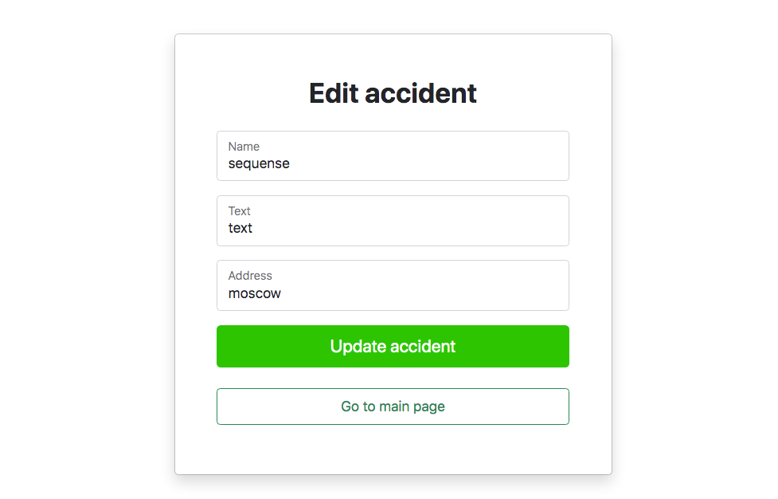
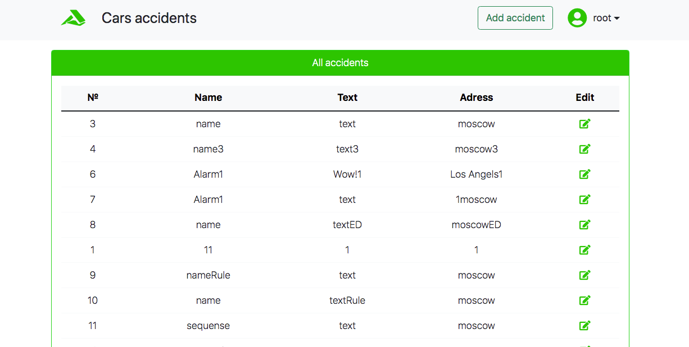

В блоке Spring мы будем разрабатывать проект - Автонарушители.

В системе существуют две роли. Обычные пользователи и автоинспекторы.

Пользователь добавляет описание автонарушение.

В заявлении указывает: адрес, номер машины, описание нарушения и фотографию нарушения.

У заявки есть статус. Принята. Отклонена. Завершена.

Вид системы. Главная страница - это поиск с таблицей.